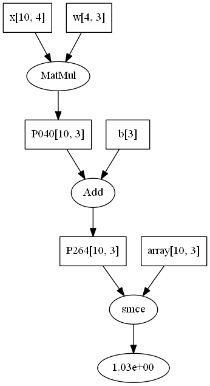

# Toych

State-of-the-art deep learning framework. Just kidding 🤣🤣

## How to play

Try out the following code.

```python
>>> import toych as tc
>>> from toych import Param

"Use toych operations or functions like numpy functions."
>>> tc.max([1, 2, 3])
3
>>> tc.sum(np.array([1, 2, 3]))
6

"Create a Param."
>>> Param.auto_name = True  # automatically name the Param (only for fun, sometimes slow)
>>> x = Param([1, 2, 3]); x
x(<3>, variable)  # the first item is the shape of the Param, the second is its kind
>>> y = tc.max(x)
>>> y2 = x.max()  # the same as y

"Pass backwards the gradient with regard to a scalar Param."
>>> y.backward()  # returns a list of related Params
[x(<3>, trainable), y(3.0, variable)]
>>> x.grad
array([0., 0., 1.])
>>> x.zero_grad(); x.grad
0
>>> list(x.sum().backward())
[x(<3>, trainable), P904(6.0, variable)]
>>> x.grad
array([1., 1., 1.])

"Convert an array to Param."
>>> import numpy as np
>>> y = np.random.randint(3, size=10)
>>> y = tc.utils.onehot(y, k=3)
>>> z = y.view(Param)  # view y as a constant Param (the data is shared)
>>> z[0, 0] = 999
>>> y[0, 0]
999

"Fill up a Param."
>>> Param(0, size=[3, 3]).data
array([[0., 0.],
       [0., 0.]])
>>> Param([1, 2, 3], size=[2, 3], dtype=int).data
array([[1, 2, 3],
       [1, 2, 3]])

"Create a random Param."
>>> x = Param(size=[10, 4], kind='constant'); x
x(<10, 4>, constant)
>>> x.shape
(10, 4)
>>> Param(size=[10, 4], mean=1, scale=1, name='x1')  # specify mean, scale and name
x1(<10, 4>, trainable)  # by default, the kind is "trainable"
>>> x.data  # check the data in the form of an array
array([...])
>>> w = Param(size=[4, 3])
>>> b = Param(size=3)

"Let's have some SGD! 😁"
>>> y = tc.utils.onehot(np.random.randint(3, size=10), k=3)  # OK to directly use numpy arrays
>>> e = (x @ w + b).smce(y)  # softmax cross-entropy
>>> tc.utils.graph.show_compgraph(e)  # see the graph below
<graphviz.dot.Digraph object at ...>
>>> def SGD(pars):
        for p in pars:
            if p.trainable:
                p -= 1e-3 * p.grad
            p.zero_grad()
>>> SGD(e.backward())

"Some toych functions can be constructed to have trainable Params in addition to being applied directly."
>>> np.all(tc.Affine(x, w, b) == x @ w + b)
array(True, constant)
>>> affine = tc.Affine(2)  # pass the output dimension to construct an Affine function containing trainable Params
>>> np.all(affine(x) == x @ affine.w + affine.b)
array(True, constant)
>>> imgs = Param(size=[100, 3, 256, 256], kind='constant')
>>> conv = tc.Conv2D(32, size=(5, 5), stride=2)
>>> h = conv(imgs); h  # pass the input to inform `conv` the input channels
h(<100, 32, 126, 126>, variable)
>>> xn = tc.normalize(x)
>>> xn.mean(), xn.std()
(<sth. close to 0.>, <sth. close to 1.>)
>>> Norm = tc.normalize(axis=0)
normalize()  # now it is a function containing trainable weight and bias
>>> Norm(x); x.shape
(10, 4)
>>> Norm.w, Norm.b
(P304(<1, 4>, trainable), P416(<1, 4>, trainable))

"Compose several functions to build a neural network!"
>>> from toych.func import *
>>> nn = tc.model.Compose(
        Conv2D(32, size=(5, 5), stride=2),
        Conv2D(64, size=(5, 5), stride=2),
        Conv2D(128, size=(3, 3), stride=2),
        MaxPool2D((4, 4)),
        flatten,
        Affine(64), normalize(),
        dropout, ReLU,  # dropout as a normal function
        Affine(32), normalize(),
        dropout(0.2), ReLU,  # dropout as an initialized function (rate=0.2)
        Affine(10), softmax
    )
>>> pred = nn(imgs)  # quite slow!
pred(<100, 10>, variable)
>>> y = tc.utils.onehot(np.random.randint(10, size=100), 10)
>>> loss = pred.crossentropy(y)
>>> SGD(loss.backward())
```



## TODO

* [ ] let toych play with 2048
* [ ] FIX Conv2D
* [ ] implement VAE
* [ ] implement GAN
* [ ] implement ResNet
* [ ] implement a transformer
